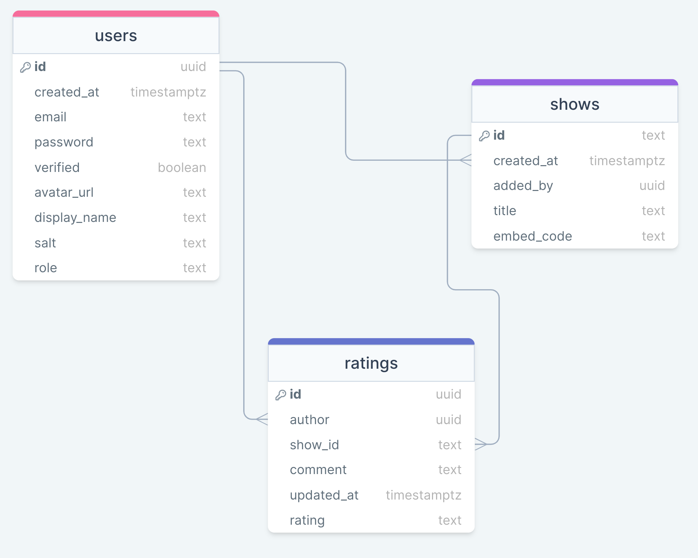

# RateSQ ⭐⭐⭐⭐⭐

Web app for rating opening sequence of tv shows

[](https://codecov.io/gh/ize-302/rate-sq)
[](https://github.com/ize-302/rate-sq/actions/workflows/ci.yml)

#### Tech Stack

- [NextJS](https://nextjs.org/)
- PostgreSQL with ([NeonDB](https://neon.tech))
- [Jest](https://jestjs.io/) for testing
- [TailwindCSS](https://tailwindcss.com) & [Mantine](https://mantine.dev/)
- Hosted on [Vercel](https://vercel.com)
- TV shows powered by [TMDB](https://themoviedb.org/)

#### Database Structure / Relationship 💾

(https://drawsql.app/teams/team-ize/diagrams/rate-sq)

#### How to run 🏃

##### Requirements

- Access token key from themoviedb developer account https://developer.themoviedb.org
- Postgresql config. This setup uses neondb https://neon.tech/
- Good to go 🔥 🔥 🔥

##### Proceedures

- Clone the repo
- Run `yarn install` to install dependencies
- Run `Yarn dev` to run in development mode
- This usually runs on port 3000 unless otherwise stated

##### PS 👋

Run the following in your SQL editor to create the required tables

```
CREATE TABLE profiles (
    id uuid PRIMARY KEY,
    created_at timestamptz NOT NULL DEFAULT NOW(),
    email text,
    password text,
    verified bool DEFAULT false,
    avatar_url text NULL,
    display_name text,
    salt text,
    role text DEFAULT user
);
```

```
CREATE TABLE Titles (
    id text PRIMARY KEY,
    created_at timestamptz NOT NULL DEFAULT NOW(),
    added_by uuid,
    name text,
    embed_code text
);
```

```
CREATE TABLE Ratings (
    id uuid PRIMARY KEY,
    author uuid,
    rating numeric,
    comment text,
    updated_at timestamptz NOT NULL DEFAULT NOW(),
    show_id text
);
```
